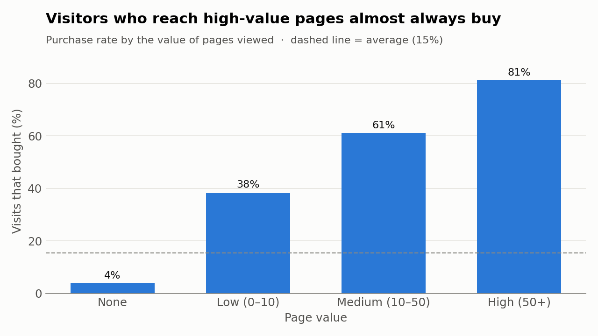
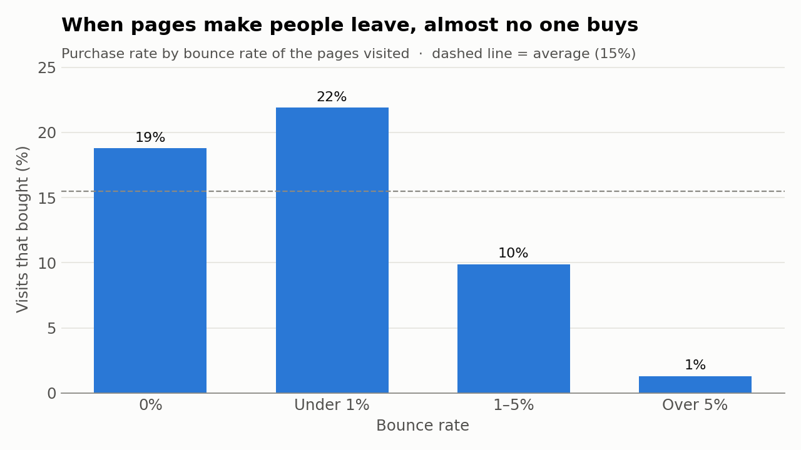
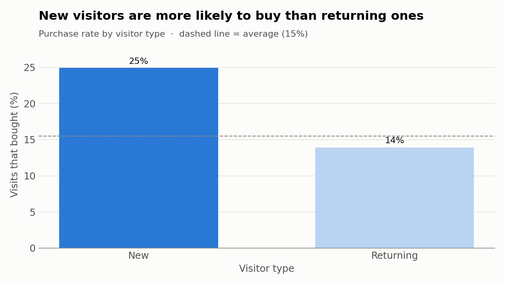
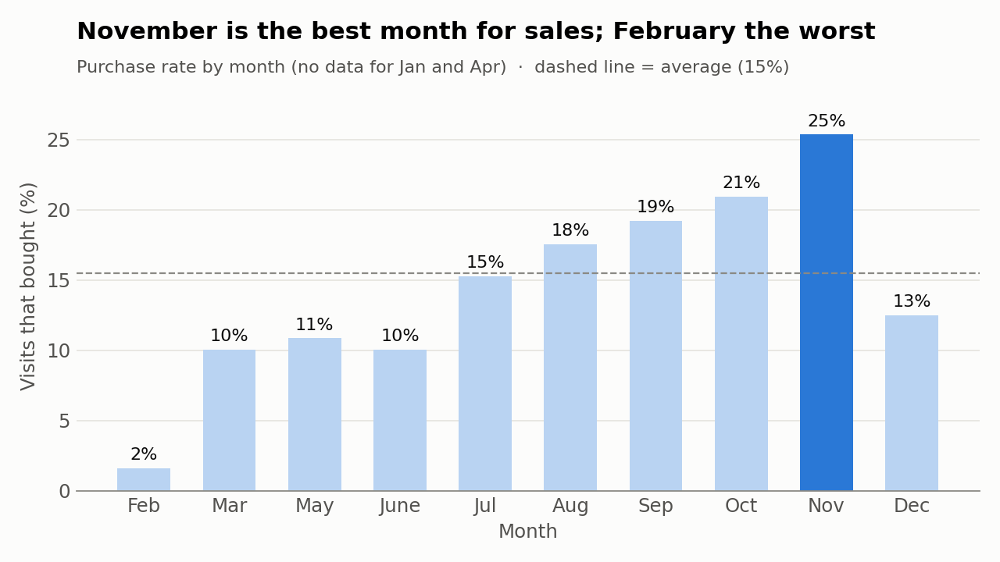
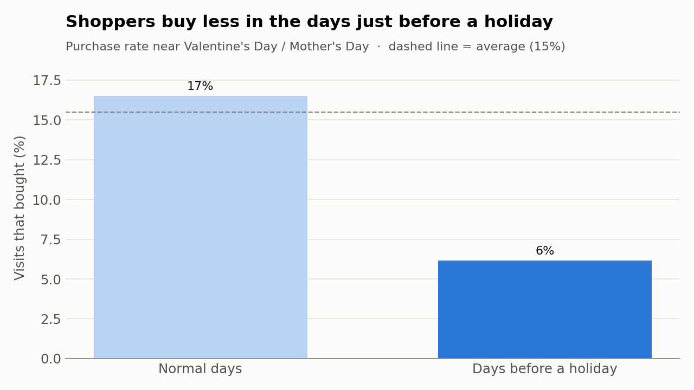

# 🛒 Browsers vs. Buyers
### What makes online shoppers actually buy?

**Patterns & Signals · Project 01**

Most people who visit an online store leave without buying anything. Using **12,330 real shopping sessions** from one online store over a year, I looked at what separates the visitors who buy from those who just browse.

**Only 15% of visits ended in a purchase.** Here's what the other 85% tell us.

---

## 📌 Key findings

### 1. Where people go matters most


Visitors who never reached a "high-value" page (product details, the cart, checkout) bought only **4%** of the time. Those who did reached **81%**.
👉 The challenge isn't getting traffic. It's getting visitors to the right pages.

### 2. Bad first impressions kill sales


On pages people tend to leave straight away (bounce rate over 5%), only **1%** of visits ended in a purchase.

### 3. New visitors buy more than returning ones 🤔


This one surprised me. **25%** of new visitors bought, compared with **14%** of returning visitors. My reading of the human side: returning visitors are often *still deciding*. They come back to compare, check prices, or think it over. New visitors often arrive with a goal (from an ad or a search) and act on it.

### 4. Timing changes the mindset



**November** converts best (25%), the deal-hunting run-up to Black Friday. In the days just before gift holidays like Valentine's and Mother's Day, conversion drops to **6%**. People **browse for gift ideas**, but many don't buy here, or they buy at the last minute.

---

## 💡 Recommendations
1. **Shorten the path to product pages** with recommendations, clear navigation and visible "add to cart" buttons.
2. **Fix the pages people leave most often.**
3. **Give returning visitors a reason to decide now**, such as saved-cart reminders or limited-time offers.
4. **Turn holiday browsers into buyers** with gift guides and "arrives by" delivery promises.

## ⚠️ Limitations
- The data comes from **one store over one year**, so results may not apply to every business.
- These are **patterns, not proof of cause**. Visiting valuable pages goes together with buying, but that doesn't prove the pages *cause* the purchase.
- There's no data for January or April.

---

## 🛠️ How I did it
| Step | What I did | Tool |
|---|---|---|
| Clean | Checked for missing values and duplicates | Python (pandas) |
| Explore | Grouped visits and compared purchase rates | Python (pandas) |
| Visualise | Built the charts above | matplotlib |
| Dashboard | Interactive version *(coming soon)* | Tableau |

📓 **Full step-by-step analysis:** [analysis.ipynb](analysis.ipynb)

## 📂 Files
```
01-online-shoppers/
├── analysis.ipynb                     ← the full analysis, explained step by step
├── data/
│   ├── online_shoppers_intention.csv  ← original data
│   └── online_shoppers_tableau.csv    ← cleaned data for Tableau
└── images/                            ← charts
```

## 📚 Data source
Sakar, C.O., Polat, S.O., Katircioglu, M. & Kastro, Y. (2019). *Online Shoppers Purchasing Intention Dataset.* [UCI Machine Learning Repository](https://archive.ics.uci.edu/dataset/468/online+shoppers+purchasing+intention+dataset). Licensed under CC BY 4.0.
